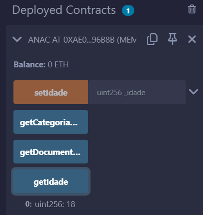
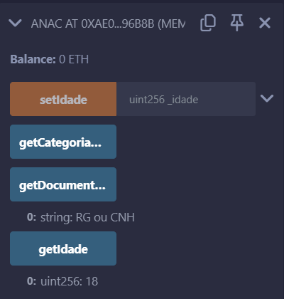
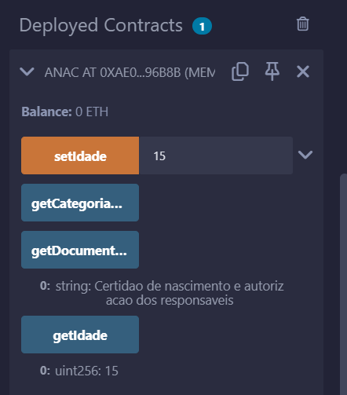
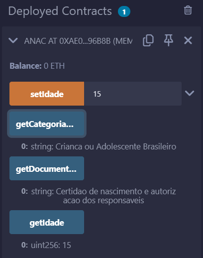
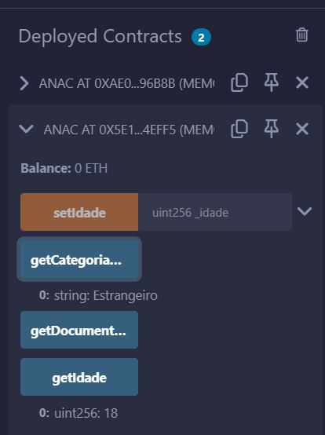
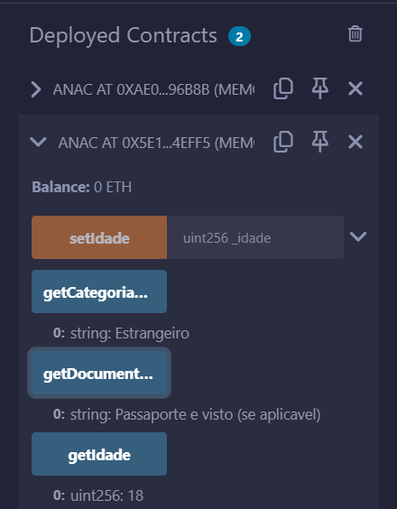

# Documentação de Testes - Smart Contract `anac.sol`

## Introdução
Este documento descreve os testes realizados no contrato inteligente `Anac`, desenvolvido em Solidity e testado no Remix IDE.

O contrato gerencia a idade de passageiros, classificando-os em:
- Adultos Brasileiros (≥ 18 anos)
- Crianças e Adolescentes Brasileiros (< 18 anos)
- Estrangeiros (qualquer idade)

A documentação necessária varia de acordo com a classificação.

---

## 1. Testes com Passageiros Brasileiros
Os testes abaixo foram realizados com um passageiro brasileiro (`true`) ao implantar o contrato.

### 1.1 Verificar idade inicial
- **Entrada:** Chamar `getIdade()`
- **Saída esperada:** `18`

---

### 1.2 Verificar documentação necessária para adulto brasileiro
- **Entrada:** Chamar `getDocumentacaoNecessaria()`
- **Saída esperada:** `"RG ou CNH"`

---

### 1.3 Alterar idade para 15 anos
- **Entrada:** Chamar `setIdade(15)`
- **Saída esperada:** A transação deve ser aceita

---

### 1.4 Verificar categoria do passageiro após mudança de idade
- **Entrada:** Chamar `getCategoriaPassageiro()`
- **Saída esperada:** `"Crianca ou Adolescente Brasileiro"`

---

## 2. Testes com Passageiros Estrangeiros
Os testes abaixo foram realizados implantando o contrato com passageiro estrangeiro (`false`).

### 2.1 Verificar categoria do passageiro
- **Entrada:** Chamar `getCategoriaPassageiro()`
- **Saída esperada:** `"Estrangeiro"`

---

### 2.2 Verificar documentação necessária para estrangeiro
- **Entrada:** Chamar `getDocumentacaoNecessaria()`
- **Saída esperada:** `"Passaporte e visto (se aplicavel)"`

---

## Uso de IA no Desenvolvimento  

Durante o desenvolvimento do contrato `Anac.sol`, houve dificuldades na implementação da restrição que permite apenas ao dono modificar a idade do passageiro. Para resolver isso, foi utilizada uma IA para compreender o conceito de **modifier** e sua aplicação correta. Além disso, a IA ajudou a estruturar os comentários do código de forma mais coesa e alinhada às boas práticas, garantindo maior clareza e padronização na documentação interna.
